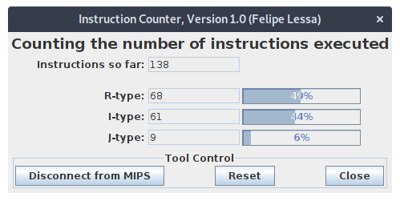

# Giải pháp hiện thực

Chương trình được viết với ngầm định rằng các input của nó (2 số thực chính xác đơn) sẽ thuộc dạng
chuẩn. Các trường hợp khác (subnormal, infinity, NaN) sẽ không được đảm bảo sẽ tạo ra kết quả chính
xác.

Ta biết rằng một sô thực chính xác đơn sẽ có 3 phần - sign, exponent và fraction. Hướng tiếp cận
của chương trình là tách ba phần đó ra từ 2 số, lưu mỗi phần vào một thanh ghi riêng. Các thanh ghi
này được coi là đang lưu số thực đó dưới dạng trung gian trong lúc xử lí.

Lưu ý đối với chương trình là nó sẽ không xử lí tình huống việc tinh toán tạo ra kết quả làm
overflow hay underflow phần exponent.

Một lưu ý nữa là chương trình sẽ áp dụng chiến thuật làm tròn truncate (cắt bỏ) - nghĩa là nếu có
một bit nào đó bị lọt ra khói khoảng 24 bit được dùng để chứa phần fraction trong biểu diễn trung
gian, nó sẽ bị cắt bỏ. Chiến thuật làm giúp ta không phải làm tròn kết quả.

Ta liệt kê ra các bước thực hiện tính toán

1. So sánh và dịch dạng trung gian cho tới khi chúng có phần exponent bằng nhau

2. Cộng phần trung gian

3. Chuẩn hóa biểu diễn trung gian (để độ dài còn 24 bit với giá trị bit 1 ở vị trí 24)

4. Kiểm tra underflow và overflow cho exponent sau khi chuẩn hóa

# Thống kê số lệnh, loại lệnh sử dụng trong chương trình

Đây là kết quả từ một lần chạy thử của chương trình với đầu vào 100.25 và 0.1. Trong trường hợp lỗi
sẽ có xuất hiện thêm một số lượng ít lệnh nữa. Nhưng ta sẽ coi trung bình số lệnh sẽ rất gần với
kết quả thống kê trên.

Ta có:

- Tổng số lệnh: 138

- Số lệnh dạng R: 68

- Số lệnh dạng I: 61

- Số lệnh dạng J: 9

# Tính thời gian chạy của chương trình

Với kết quả số lệnh trên, ta tính toán thời gian thời gian thực hiện chương trình với bộ xử lý
chạy ở xung nhịp CR = 100 Ghz.

Ta cho rằng bộ xử lý này là đơn chu kì (không pileline). Với CPI cho mọi lệnh bằng 1. Thời gian
xử lý có thể được tính

\begin{align*}
\text{Time} &= \text{Clock Period} * \text{Instruction Count}
            &= \frac{1}{CR} * 138
            &= 138 \text{ns}
\end{align*}

# Kết quả kiểm thử

Đây là kết quả từ cùng lần chạy thử với mục thống kê số lệnh.

